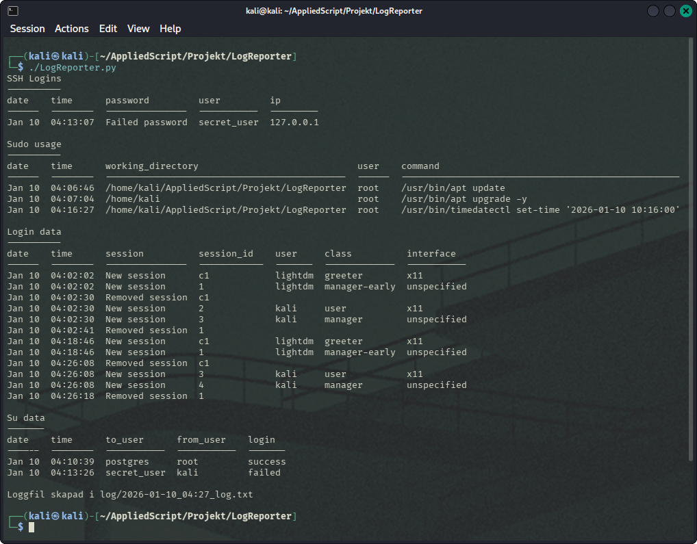
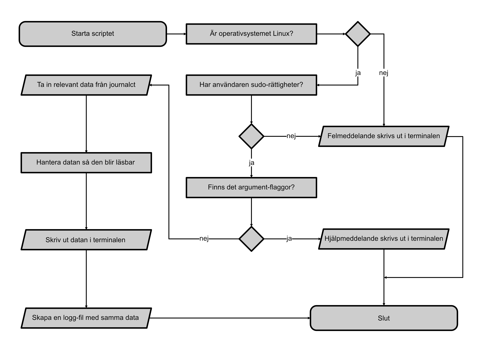

# LogReporter
_Version 0.92_

Python-script som används för att undersöka diverse loggfiler på ett Linux-system med syfte att informera om någon har loggat in på systemet senaste dygnet och då ge information om när och hur.

Scriptet ska fungera på alla Linuxbaserade system som använder sig av journalctl.

## Systemkrav
- Linux
- Python 3.10+
- sudo-rättigheter (kontrolleras automatiskt av scriptet)

## Beroenden
Scriptet kräver externa Python-bibliotek som listas i `requirements.txt`.

Notera att beroenden installeras för aktuell Python-miljö. Rekommendation är att installera beroenden och starta upp i en [venv](https://docs.python.org/3/library/venv.html).

## Rekommenderad instruktion för installation

    git clone https://github.com/inverterad/AppliedScript.git
    cd AppliedScript/Projekt/LogReporter
    python3 -m venv venv
    source venv/bin/activate
    python3 -m pip install -r requirements.txt
    chmod +x LogReporter.py

## Användning

    sudo ./LogReporter.py

## Flaggor
- -h, --help : Visar hjälpsida.
- -v, --version : Visar vilken version av scriptet du använder.

## Funktion
Samlar in information via journalctl om:

- SSH logins
- Sudo-användning
- Login-data
- Kommandot su

Loggarna formateras till ett mer läsbart format och visar upp i standard output. Det skapas även en loggfil i katalogen:

    LogReporter/log/

## Screenshot / Video
Exempel på då scriptet körts

## Flödesschema

## Roadmap

| Feature | Kommentar |
|-|-|
| Nätverkslog | Kort sikt
| Flagga för insamling av data över längre tid | Kort sikt
| Byta till modulen _logging_ istället för egentillverkad | Kort sikt
| Logga rå data | Kort sikt
| Kryptera eller ta bort rättigheter för loggfiler | Lång sikt
| Göra en version för Windows | Lång sikt