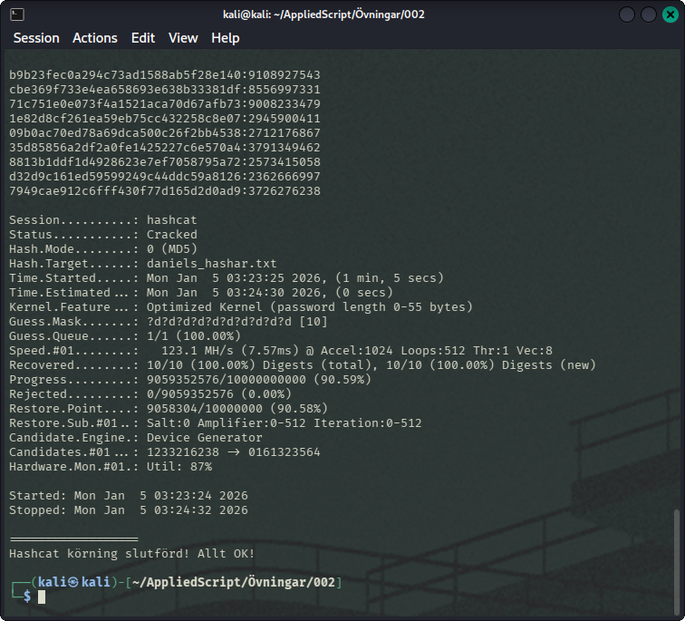

# Övning 2 - MD5 Hash Checker med Python och Hashcat

I denna övning arbetar jag med hashvärden, lösenordsgenerering och lösenordsknäckning. Jag har modifierat ett befintligt script för att uppfylla vissa krav.

md5-hasher-unsecure.py är ett python-script som genererar 10 st md5-hashar på 9 st slumpmässiga siffror.

md5_hashcat.sh är ett bash-script som sedan ska kunna cracka md5-hashen och få fram siffrorna. Här nedan ser vi ett exempel på min kodpartner Daniels test-hashar. Kommandot som användes var:

    ./md5_hashcat.sh daniels_hashar.txt ?d?d?d?d?d?d?d?d?d?d

Aktivera scriptet, välj fil och till sist vilken mask vi ska använda via hashcat.

